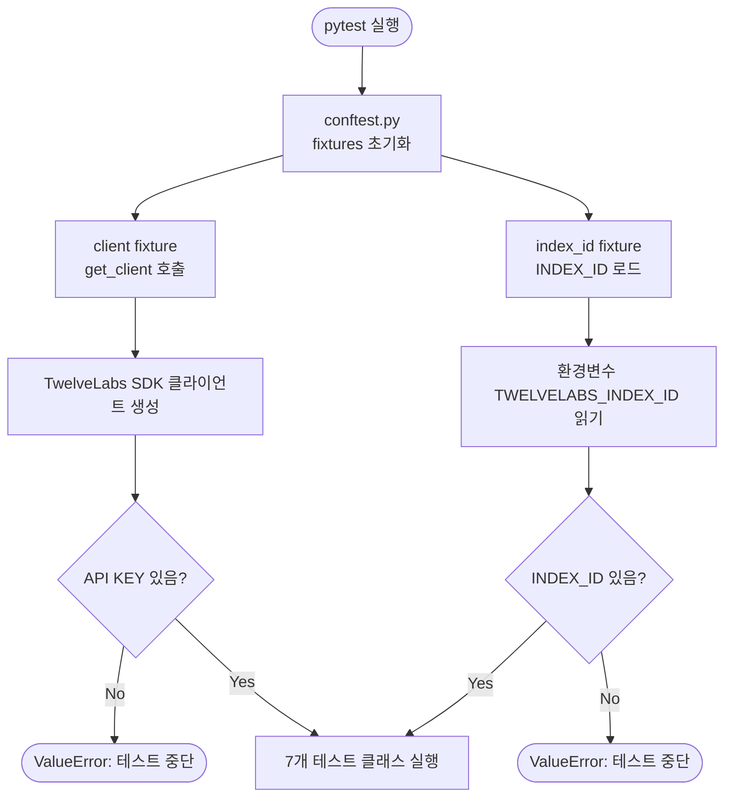
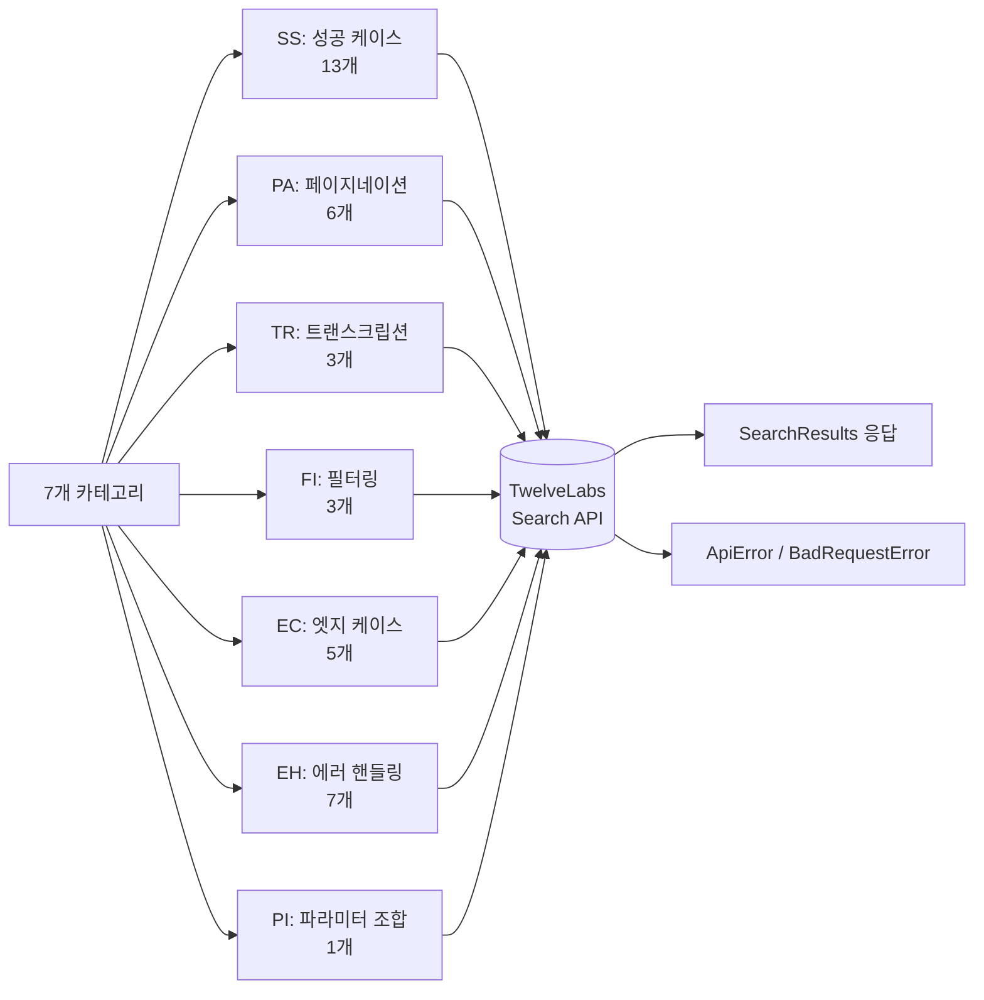
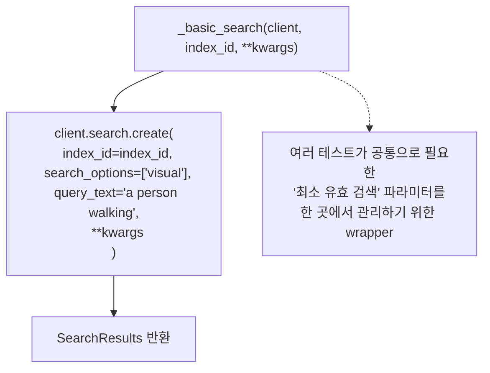
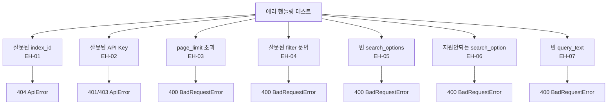
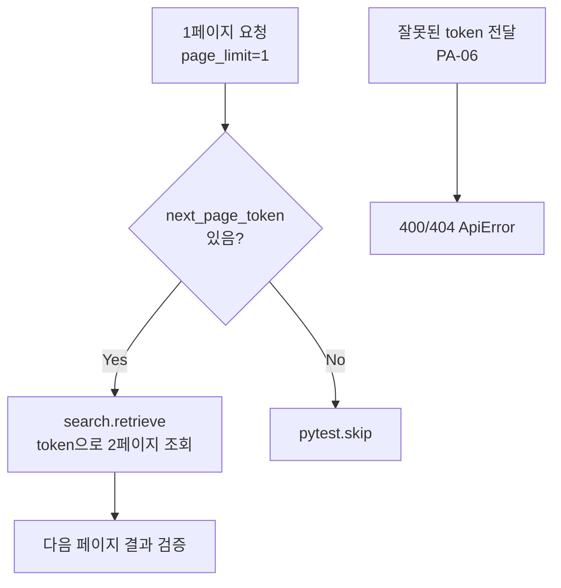

# 테스트 흐름도

## 전체 실행 흐름

```mermaid
flowchart TD
    A([pytest 실행]) --> B[conftest.py<br/>fixtures 초기화]
    B --> C1[client fixture<br/>get_client 호출]
    B --> C2[index_id fixture<br/>INDEX_ID 로드]
    C1 --> D[TwelveLabs SDK 클라이언트 생성]
    C2 --> E[환경변수 TWELVELABS_INDEX_ID 읽기]
    D --> F{API KEY 있음?}
    E --> G{INDEX_ID 있음?}
    F -- No --> ERR1([ValueError: 테스트 중단])
    G -- No --> ERR2([ValueError: 테스트 중단])
    F -- Yes --> H[7개 테스트 클래스 실행]
    G -- Yes --> H
```

---

## 테스트 카테고리별 흐름

```mermaid
flowchart LR
    H[7개 카테고리] --> SS[SS: 성공 케이스\n13개]
    H --> PA[PA: 페이지네이션\n6개]
    H --> TR[TR: 트랜스크립션\n3개]
    H --> FI[FI: 필터링\n3개]
    H --> EC[EC: 엣지 케이스\n5개]
    H --> EH[EH: 에러 핸들링\n7개]
    H --> PI[PI: 파라미터 조합\n1개]

    SS --> API[(TwelveLabs\nSearch API)]
    PA --> API
    TR --> API
    FI --> API
    EC --> API
    EH --> API
    PI --> API

    API --> RES[SearchResults 응답]
    API --> ERR[ApiError / BadRequestError]
```

---

## _basic_search 헬퍼 흐름

```mermaid
flowchart TD
    CALL["_basic_search(client, index_id, **kwargs)"] --> WRAP["client.search.create(\n  index_id=index_id,\n  search_options=['visual'],\n  query_text='a person walking',\n  **kwargs\n)"]
    WRAP --> RET[SearchResults 반환]

    NOTE["여러 테스트가 공통으로 필요한\n'최소 유효 검색' 파라미터를\n한 곳에서 관리하기 위한 wrapper"]
    CALL -.-> NOTE
```

---

## 에러 케이스 흐름

```mermaid
flowchart TD
    EH[에러 핸들링 테스트] --> E1[잘못된 index_id\nEH-01]
    EH --> E2[잘못된 API Key\nEH-02]
    EH --> E3[page_limit 초과\nEH-03]
    EH --> E4[잘못된 filter 문법\nEH-04]
    EH --> E5[빈 search_options\nEH-05]
    EH --> E6[지원안되는 search_option\nEH-06]
    EH --> E7[빈 query_text\nEH-07]

    E1 --> R404[404 ApiError]
    E2 --> R401[401/403 ApiError]
    E3 --> R400A[400 BadRequestError]
    E4 --> R400B[400 BadRequestError]
    E5 --> R400C[400 BadRequestError]
    E6 --> R400D[400 BadRequestError]
    E7 --> R400E[400 BadRequestError]
```

---

## 페이지네이션 흐름

```mermaid
flowchart TD
    PA01[1페이지 요청\npage_limit=1] --> TOK{next_page_token\n있음?}
    TOK -- Yes --> PA05[search.retrieve\ntoken으로 2페이지 조회]
    TOK -- No --> SKIP[pytest.skip]
    PA05 --> NEXT[다음 페이지 결과 검증]

    INVALID[잘못된 token 전달\nPA-06] --> ERR[400/404 ApiError]
```